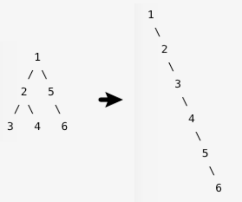
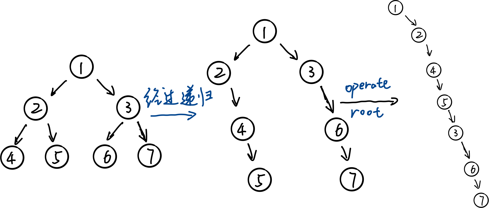

# 114-flatten-binary-tree-to-linked-list

给定二叉树，**原地**展开成一个单链表

示例



Leetcode已给代码如下

```python
# Definition for a binary tree node.
# class TreeNode:
#     def __init__(self, val=0, left=None, right=None):
#         self.val = val
#         self.left = left
#         self.right = right
class Solution:
    def flatten(self, root: TreeNode) -> None:
        """
        Do not return anything, modify root in-place instead.
        """
```


--------------------

##### 1. 递归遍历

肯定是套用遍历的框架

```python
class Solution1_1:
    def flatten(self, root: TreeNode) -> None:
        """
        Do not return anything, modify root in-place instead.
        """
        #base case
        self.flatten(root.left)
        self.flatten(root.right)
        #operate root
        return root
```

我们需要去填写 #base case 和 #operate root 的部分。

先去考虑 root 的部分，假如现在子节点已经展开好了，最外面一层的操作是怎么样子的呢？



我们不需要过于去关注为什么经过递归后，最外面一层变回成那样，我们只需要相信所写的递归函数能做到。

#base case，当递归到最低层的时候，即4的子节点

所以最后的代码就是这样的

```python
class Solution1_1:
    def flatten(self, root: TreeNode) -> None:
        """
        Do not return anything, modify root in-place instead.
        """
        #base case
        if not root: return root
        
        self.flatten(root.left)
        self.flatten(root.right)

		#operate root
        temp = root.right
        root.left, root.right = None, root.left
        head = root
        while head.right:
        	head = head.right
        head.right = temp
        
        return root
```

##### 上面是后序遍历，实际上前序遍历也可以

```python
class Solution1_2:
    def flatten(self, root: TreeNode) -> None:
        """
        Do not return anything, modify root in-place instead.
        """
        #base case
        if not root: return root
        
        #operate root
        right = root.right
        root.left, root.right = None, root.left
        
        p = root.right
        while p.right:
            p = p.right
        p.right = right
        
        #self.flatten(root.left) 由于root.left已经是None，所以不需要递归
        self.flatten(root.right)
        
        return root
```

