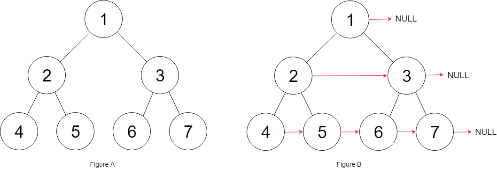
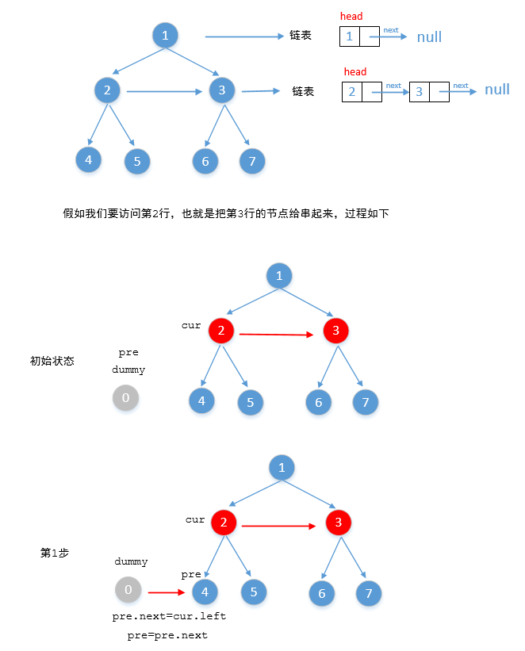
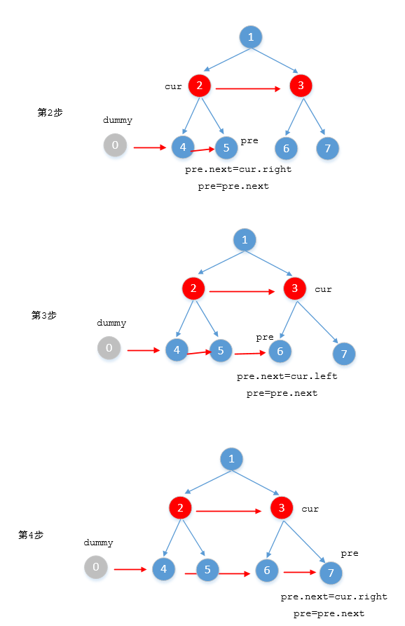
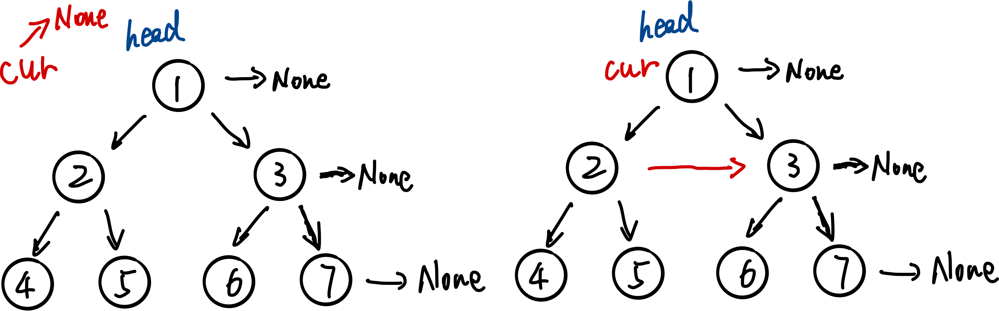
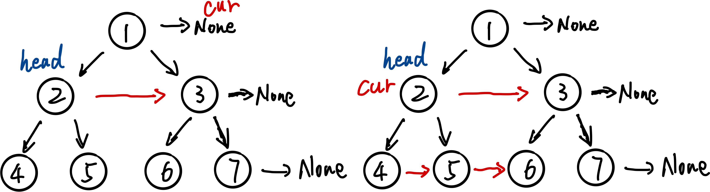
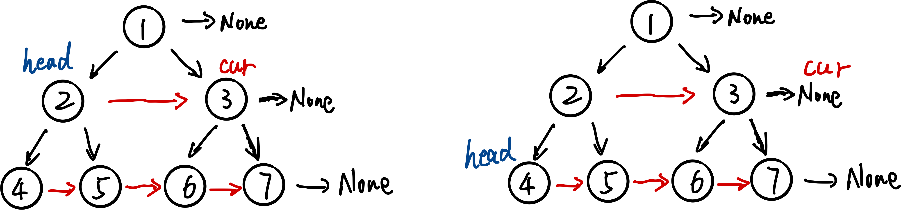

题目要求：

给定一个**完美二叉树**，所有叶子节点在同一层，每个父节点有2个子节点，定义如下：

```python
# Definition for a Node.
class Node:
    def __init__(self, val: int = 0, left: 'Node' = None, right: 'Node' = None, next: 'Node' = None):
        self.val = val
        self.left = left
        self.right = right
        self.next = next
```

***需要我们干嘛？***

填充每个节点的next指针，指向右侧的一个节点，如果右侧没有节点，指向None

示例：



```python
class Solution:
    def connect(self, root: 'Node') -> 'Node':
      	pass
```

提示：

- 空间复杂度：O(1)
- 可以使用递归，递归占用的栈空间不算做额外的空间复杂度

------------------------------

##### 1. 递归

先写框架

```python
class Solution1_1:
    def connect(self, root: 'Node') -> 'Node':
    		if not root: return root
        
        # preorder
        self.connect(root.left)
        self.connect(root.right)
        
        return root
```

修改框架

```python
class Solution1_1:
    def connect(self, root: 'Node') -> 'Node':
    		if not root or not root.left: return root
        
        root.left.next = root.right
        root.right.next?????
        self.connect(root.left)
        self.connect(root.right)
        
        return root
```

我们发现对于一个父节点的右节点，很难与另一个父节点的左节点连起来。

因此我们需要引入辅助函数。

```python
class Solution1_1:
    def connect(self, root: 'Node') -> 'Node':
        if not root: return root

        def helper(node1, node2):
            if not node1 or not node2: return
            
            node1.next = node2
            
            helper(node1.left, node1.right)
            helper(node2.left, node2.right)

            helper(node1.right, node2.left)
        		return
          
        helper(root.left, root.right)
        return root
```

##### 2. BFS

```python
from collections import deque
class Solution2_1:
    def connect(self, root: 'Node') -> 'Node':
        if not root: return root

        queue = deque()
        queue.append(root)

        while queue:
            size = len(queue)
            for i in range(size):
                node = queue.popleft()
                if i == size - 1:#node is the last one
                    node.next = None
                else:
                    node.next = queue[0]
                if node.left: queue.append(node.left)
                if node.right: queue.append(node.right)
        
        return root
```

##### 3. 将每一行当成一个链表来处理





```python
class Solution3_1:
    def connect(self, root: 'Node') -> 'Node':
        if not root: return root

        cur_node = root
        while cur_node != None:
            dummy = Node(0)
            child_node = dummy
            
            while cur_node != None and cur_node.left != None:
                child_node.next = cur_node.left
                child_node = child_node.next
                child_node.next = cur_node.right
                child_node = child_node.next

                cur_node = cur_node.next
            
            cur_node = dummy.next

        return root
```


##### 3+ 在3.中利用完全二叉树的特点







```python
class Solution3_2:
    def connect(self, root: 'Node') -> 'Node':
        if not root: return root

        head = root
        cur = None
        while head.left:
            cur = head
            while cur:
                cur.left.next = cur.right
                if cur.next:
                    cur.right.next = cur.next.left
                cur = cur.next
            
            head = head.left
        return root
```

