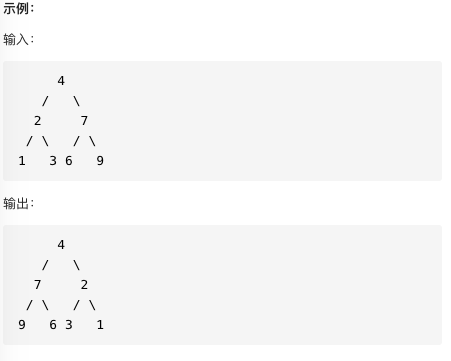
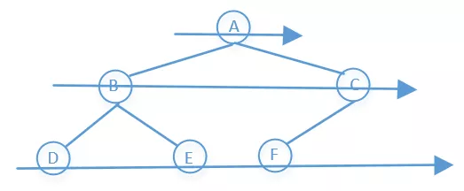

##### 题目要求

翻转二叉树



----------------------

##### 树的遍历框架

```python
# 二叉树遍历框架(递归)
def traverse(root: TreeNode):
		##前序遍历
    traverse(root.left)
    ##中序遍历
    traverse(root.right)
    ##后序遍历
```

经过观察，我们发现，只要把每个节点的左右子节点进行交换，即可完成题目的要求。

##### 解法1 递归

如果按照二叉树遍历框架来写，这一题用前序遍历和后序遍历都可以解决问题

```python
class Solution:
    def invertTree(self, root: TreeNode) -> TreeNode:
        #base case
        if not root: return root

        #preorder
        root.left, root.right = root.right, root.left
        self.invertTree(root.left)
        self.invertTree(root.right)

        return root
```

如果需要写的简洁一点，更pythonic一点

```python
class Solution:
    def invertTree(self, root: TreeNode) -> TreeNode:
        #base case
        if not root: return root

        root.left, root.right = self.invertTree(root.right), self.invertTree(root.left)

        return root
```

##### 解法2 BFS



套二叉树BFS框架

```python
class Solution2_1:
    def invertTree(self, root: TreeNode) -> TreeNode:
        if not root: return root

        queue = collections.deque()
        queue.append(root)

        while queue:
            node = queue.popleft()
            # 先交换，再将子节点添加到队列，顺序相反也可以
            node.left, node.right = node.right, node.left
            if node.left: queue.append(node.left)
            if node.right: queue.append(node.right)

        return root
```

##### 3. DFS

套用框架

```python
class Solution3_1:
    def invertTree(self, root: TreeNode) -> TreeNode:
        if not root: return root

        stack = []
        stack.append(root)

        while stack:
            node = stack.pop()
            node.left, node.right = node.right, node.left
            if node.right: stack.append(node.right)
            if node.left: stack.append(node.left)
        
        return root
```

