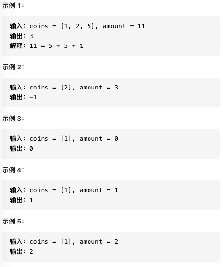

# 题目

给定
​	list: coins, 代表不同面额的硬币
​	int: amount, 代表总金额

要求
- 计算凑成 __amount__ 所需要的 __最少__ 的硬币数量
- 如果没有任何一种组合能凑成 __amount__ , 返回 -1
- 每种面额的硬币数量是无限的

边界条件
- 1 <= coins.length <= 12
- 1 <= coins\[i] <= 2^31 - 1
- 0 <= amount <= 10^4

## examples



## 思路
### 1. 自上而下动态规划（递归）

这个问题具有：最优子结构——子问题间相互独立
如果要求 amount=11 的最少硬币数
如果此时知道 amount=10 的最少硬币数， 只需要把子问题的答案+1
比如说coins=[1,2,5], amount = 11
子问题 amount=10 + 面额为1 的硬币 
子问题 amount=9 + 面额为2 的硬币 
子问题 amount=6 + 面额为5 的硬币

1. 确定base case
    amount = 0 时， 返回 0
2. 确定【状态】，原问题和子问题中会变化的变量
    由于硬币数量无限，面额也已经给定，只有总金额会不断向 base
    case 靠近，所以唯一的【状态】就是总金额 amount

3. 确定【选择】，也就是导致【状态】产生变化的行为
    在选择硬币时，每选择一枚硬币coin，相当于总金额变成了amount-coin，即改变了状态
4. 明确 dp 函数/数组的定义
    一般来说，函数的参数就是状态转移时会变化的量，即【状态】;函数的返回值就是我们要计算的答案。
    就本题来说，dp函数可以这样定义：
    dp(n) :输入目标金额n， 返回凑出目标金额n最少硬币数

#### 伪代码
```python
# 伪码框架
def coinChange(coins: List[int], amount: int):

    # 定义：要凑出金额 n，至少要 dp(n) 个硬币
    def dp(n):
        # 做选择，选择需要硬币最少的那个结果
        for coin in coins:
            res = min(res, 1 + dp(n - coin))
        return res

    # 题目要求的最终结果是 dp(amount)
    return dp(amount)
```

详细代码
```python
class Solution1:
    def coinChange(self, coins: List[int], amount: int):

        # 定义：要凑出金额 n，至少要 dp(n) 个硬币
        def dp(n):
            # base case
            if n == 0: return 0
            if n < 0: return -1
            
            # 求最小值，初始化为正无穷大
            res = float('INF')
            
            # 做选择，选择需要硬币最少的那个结果
            for coin in coins:
                subproblem = dp(n - coin)
                # 子问题无解
                if subproblem == -1: continue

                res = min(res, 1 + subproblem)

            return res if res != float('INF') else -1

        # 题目要求的最终结果是 dp(amount)
        return dp(amount)
```


#### 复杂度分析
时间复杂度：子问题总数 * 每个子问题的时间
    子问题总数为递归节点个数，是O(n^k)，每个子问题有一个for循环，是O(K)
    所以总的时间复杂度O(k*n^k)

### 2.带备忘录的递归
由于直接暴力递归时间复杂度很高，需要消除一下重叠子问题
```python
class Solution2:
    def coinChange(self, coins: List[int], amount: int):
        self.memo = dict()

        # 定义：要凑出金额 n，至少要 dp(n) 个硬币
        def dp(n):
            if n in self.memo: return self.memo[n]

            # base case
            if n == 0: return 0
            if n < 0: return -1
            
            # 求最小值，初始化为正无穷大
            res = float('INF')
            
            # 做选择，选择需要硬币最少的那个结果
            for coin in coins:
                subproblem = dp(n - coin)
                # 子问题无解
                if subproblem == -1: continue

                res = min(res, 1 + subproblem)

            self.memo[n] = res if res != float('INF') else -1

            return self.memo[n]

        # 题目要求的最终结果是 dp(amount)
        return dp(amount)
```
#### 复杂度分析
时间复杂度分析，子问题总数由于备忘录的存在，不会超过n，总的复杂度为O(kn)

### 3.自下而上的动规（迭代）
dp函数的定义与解法1类似，也是把总金额作为【状态】，不过在这里，是数组的索引
```python
class Solution3:
    def coinChange(self, coins: List[int], amount: int) -> int:
        dp = [i + 1 for i in range(amount + 1)]
        dp[0] = 0
        size = len(dp)
        for i in range(size):
            for coin in coins:
                if i - coin < 0: continue
                dp[i] = min(dp[i], 1 + dp[i - coin])
        return dp[amount] if dp[amount] != amount + 1 else -1 
```
时间复杂度与2类似

### 4.回溯（待补充）

### 5.背包问题（框架）

### 6.BFS

### 7.DFS